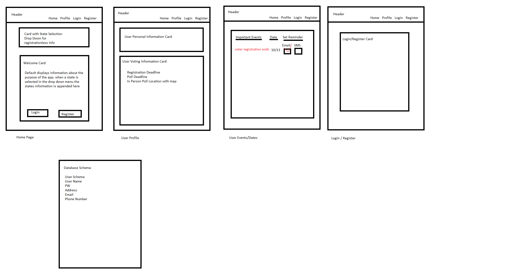

# adVOTEcate

## Table of Contents 

* [About](#About)
* [Deployment](#Deployment)
* [Installation](#Installation)
* [Usage](#Usage)
* [Technologies](#Technologies)
* [License](#License)
* [Tests](#Tests)
* [Screenshots](#Screenshots)
* [Author](#Author)
* [Questions](#Questions)

## About 

AdVOTEcate is your advocate to your voting needs! Our app shows users how to register to vote, where the nearest polls are, sends text reminders near voting dates, and provides information of how to vote by mail.

## Deployment 

https://advotecate.herokuapp.com/

## Installation

To use this app on your local computer 

* Clone the repo

* Run the command ``` npm i ``` to install dependancies 

* To run the server ``` npm start ``` 
    
## Usage
    
To give a user the ability to find the information they need to see if they are registered to vote, register to vote if they are not, where the nearest polls are, and how to vote online or by mail. 

## Technologies 
    
Technologies used in this application: Javascript, React, Express, Axios, Node, MongoDB, Material UI, Google Maps API, Passport, Quick Easy SMS API, HTML, and CSS

## License
    
MIT     

## Tests

No tests.

## Screenshots



## Author

Keith Billings

Tiana Husted

Alex Shafer

Heather Stolz
    
## Questions: 
    
If you have any questions about this project or would like to collaborrate with the authors, please reach out to anyone on the team. We look forward to working with you!

- [Keith Billings](https://github.com/KeithBillings) @ keithbillingsbusiness@gmail.com

- [Tiana Husted](https://github.com/thusted) @ tiana.husted@gmail.com

- [Alex Shafer](https://github.com/AlexShafer) @ alexander.douglas.shafer@gmail.com

- [Heather Stolz](https://github.com/Wanderingtech) @ heather86lyn@gmail.com